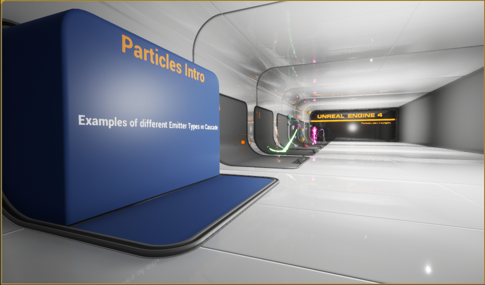

# Teaching Computer Science in VR

This is just a quick overview of what I worked on and why.

## Teaching Computer Science in VR?

When this independent study started, there were some ideas that I started at. As the study progressed the goals and ideas changed. Through this document it will go over different idea's and what was learned.

## Teaching Computer Science in VR using a Game Engine

First thing was trying to test ideas out using Unreal Engine. It seemed needed because there is limited benefit in trying to implement everything from scratch, but even with a game engine, there is a lot to learn and do to accomplish the goal.

### Display

Trying with the museum approach didn't seem viable, when I wasn't sure of what I was making. With does the museum approach, I would need a good idea of what is going in it, so that I can have everything displayed in a visually appealing way. I ended up looking at using some of Unreal Engines example displays.

Then I continued to try to work on componnents to add to the displays.

### Understanding Unreal Engine Better
I tried to understand how things work in unreal, once I studied the different class, it really helped me get a better idea of what was happening.

### Unreal Engine, creating Components

I spent a lot of time trying to understand how unreal engine works and how to implement different components. That took me until many different concepts. Like generating 100,000 instances, editing those generated instance by either moving them or deleting them (sphere trace img). VR grabbable components that changes color when picked up and can be magnetically pulled to your VR controller.

### Used blender for making Mesh's
Worked with blender to figure out how to transfer meshes over and switch out materials.

### Using Python for Mesh Generation

As I was trying to come up with ideas that could be taught in VR, I came up with making a satellite dish using a parabola and rotating the parabola to generate a mesh. I created a python script and was successful after many attempts. The goal was to render how waves hit the dish and go to the focus and how emitting from the focus, the waves go toward the dish. I got stuck on some of the math and had to move on, I didn't get the chance to finish the component.

### Helper Components

With Computer Science many topics are easier to teach by starting small and building on the concepts and ideas. My first goal was making components that were easy to configure and could build them selves. I followed a handful of videos on using Unreal Engine spline component and spawning components, to try to figure this out. The road I created one piece and it conforms to the spline. The pools I got from a Unreal Engine tutorial.

### Still no CS Topics, Generational Algorithm in HTML

I start looking for CS topics to present in VR, realizing many topics don't do much better in VR. I ended up deciding on Generational Algorithms. I worked with the Unreal Engine BP (Blueprints) trying to organize the BP's, but I needed to work on the Generational Algorithm in something I am more used to. 

I ended up getting it to work using HTML canvas and some old code that I used as a framework.

### Added Browser into Unreal Engine

I added a browser into the VR environment but I didn't see it working well, so I didn't go much further.

### Still no CS Topics, Generational Algorithm in HTML

After implementing the algorithm and having a better understanding I was then able to implement it in BP's. I started by using block and no acceleration, only movements.

I found a free 3d model of a plane (https://www.turbosquid.com/3d-models/light-vlj-obj-free/1062332), added velocity, tilt, forward, pitch and roll movement. This time the simulation is using Actors that control them selves, and there is a lot more options that can be done with this opproach. 

## In Conclusion

This was just showing some of the work I did, there was much more done and that I learned but with me being sick this is about the best I can do. I learned a lot and realized that VR does add a lot to what can be done, but it takes a large amount of work. It may be possible that VR will be easier to work with in the future but it is a very large undertaking and not very practical for an individual. This may change if tools become more building blocks and easier to work with. If a tool was more similar to html I think more possibilities would be available. 